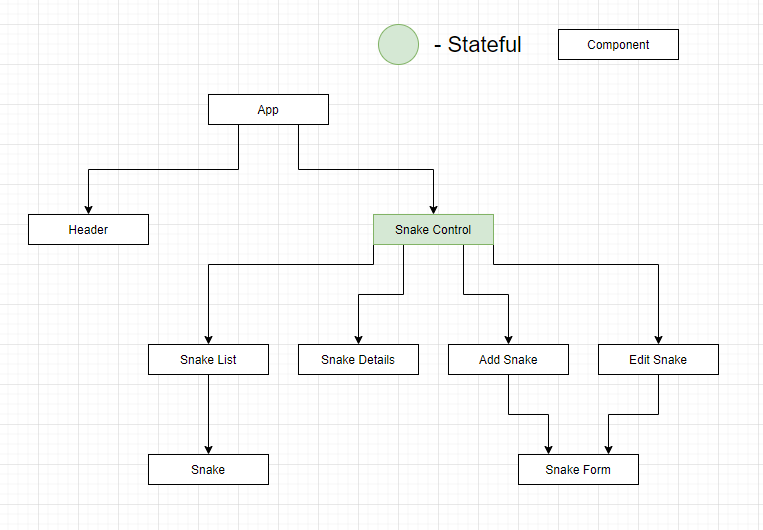

# **snakes_on_planes_redux**
Project Initiated: 2021-02-19 
Updated: 2021-02-20

## **Project Description**
This project will use allow the user to "buy" snakes for their planes.  New Snakes can be added, edited, deleted, and restocked.  This is an updated version of snakes_on_planes that incorporates Redux. 

Coding Prompt:

This is the second part of a two-section project. At the end of the last section's independent project, you built a tap room using local and shared state in React. For this independent project, you will update your application to incorporate Redux.  The first part of the project and its prompt can be found [here](https://github.com/RMGit-it/snakes_on_planes).

Before getting started, clone or fork the repo of the project you completed at the end of the last section.

Here are the requirements for the refactor:

* Shared state in your application should be handled by Redux.
* All reducers should be tested thoroughly, and all tests must be passing.
* Action creators and constants should be used.

## **Required for Use**
* A browser that can run HTML5 is required.
* Node.js (https://nodejs.org/en/)

## **Installation Instructions**
**Option 1** (direct download)
1) Copy and paste the following GitHub project link into your web browser's url bar and hit enter/return. https://github.com/RMGit-it/snakes_on_planes_redux
2) Download a .zip copy the repository by clicking on the large green "Code" button near the upper right corner of the screen.
3) Right click the .zip file and extract(unzip) it's contents.
4) Open the unzipped folder/files using Visual Studio, Visual Studio Code, or similar source code editing program.  Install all required dependencies from the package.JSON folder, and then build the program.  If you are using Node Package Manager, first navigate to the root directory of the project in your console.  You can then type the following commands to install and build the program.

    <code>npm install</code>

    <code>npm start</code>

    The code will automatically be built, and it should automatically be launched by your default web browser.

**Option 2** (via git console/terminal)
1) Open your Git enabled terminal/console and navigate to a directory that you wish to download this project to.
2) Type the following line of code into your terminal/console to automatically download the project to your current direcory and hit return/enter

    <code>git clone https://github.com/RMGit-it/snakes_on_planes_redux</code> 

3) Once the project has finished downloading, navigate to the root directory of the project in the terminal/console, and type <code>code .</code> and then hit return/enter.

    The project should automatically launch using your default source code editor.

4) Install all required dependencies from the package.JSON folder, and then build the program.  If you are using Node Package Manager, first navigate to the root directory of the project in your console.  You can then type the following commands to install and build the program.

    <code>npm install</code>

    <code>npm start</code>

    The code will automatically be built, and it should automatically be launched by your default web browser.

## **React Component Tree Diagram**

## **Known Bugs**
When restocking a snake, the quantity value displayed is inaccurate.
## **Technology Used**
* HTML
* Node.js
* React
* Redux
* React - Redux
* JavaScript
* Bootstrap
* CSS

## **Authors and Contributors**
Authored by: Randel Moore

## **Contact**
RMGit.it@gmail.com
## **License**

GPLv3

Copyright © 2020 Randel Moore